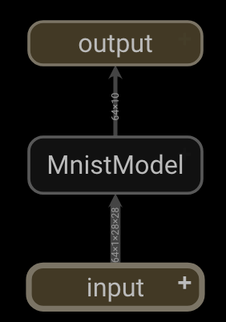
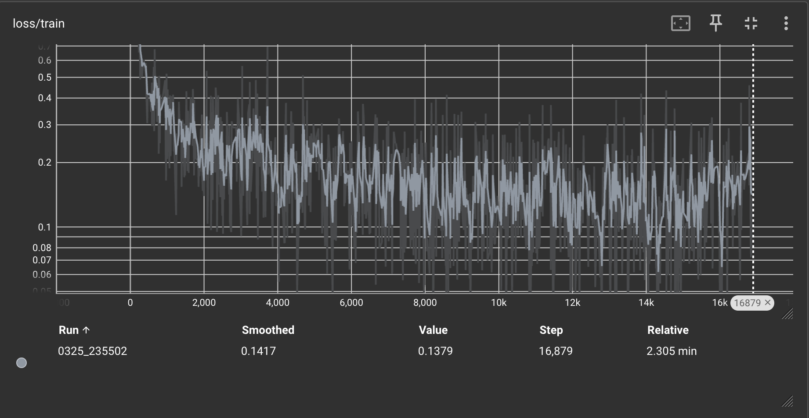
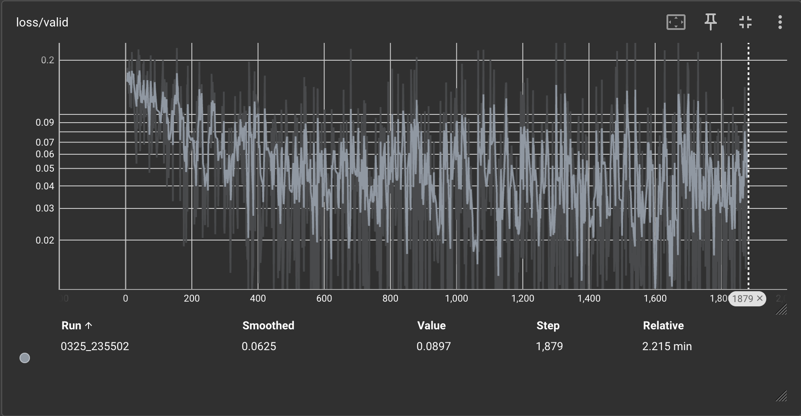
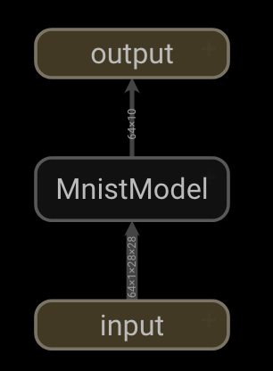
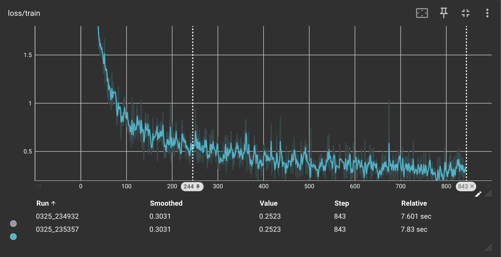
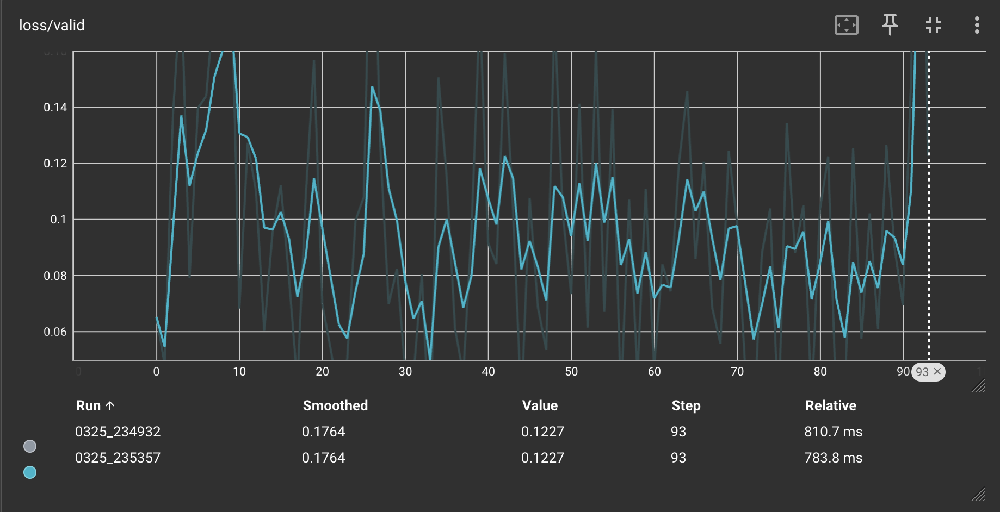
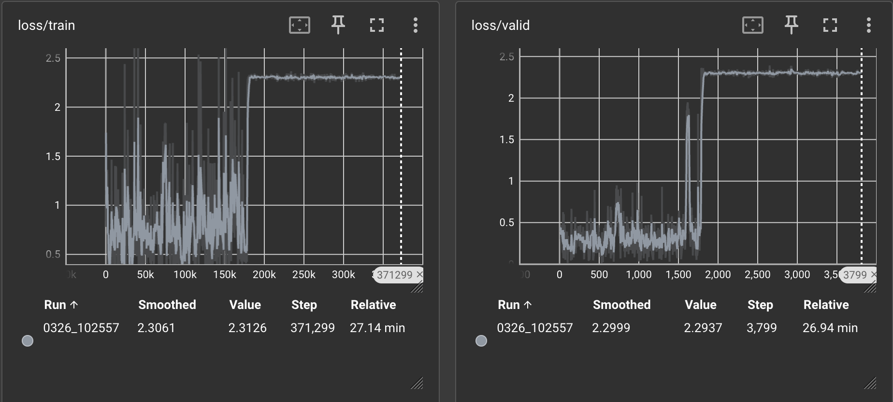
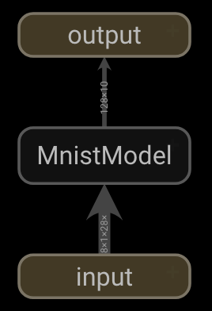
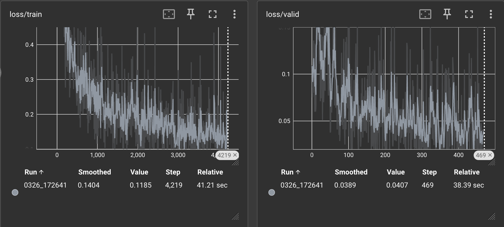

# Homework Report: PyTorch Neural Network Template Implementation

## Personal Information
- **Name:** Josh Briley
- **Date:** Mar 26, 2025
- **Course:** Health Science Meets Data Science
- **Instructor:** Olmo Zavala Romero

## Implement custom Dataset
```
import torch
from torch.utils.data import Dataset
import numpy as np
from ..base.base_data_loader import BaseDataLoader  

class FunctionDataset(Dataset):
    def __init__(self, n_samples=100, function='linear'):
        self.n_samples = n_samples
        self.function = function
        self.x = np.random.uniform(0, 2 * np.pi, n_samples)
        self.y = self.generate_y(self.x, function)

        # Normalize x and y (zero mean, unit std)
        self.x = (self.x - np.mean(self.x)) / np.std(self.x)
        self.y = (self.y - np.mean(self.y)) / np.std(self.y)

        self.x = torch.tensor(self.x, dtype=torch.float32).unsqueeze(1)
        self.y = torch.tensor(self.y, dtype=torch.float32).unsqueeze(1)

    def generate_y(self, x, function):
        epsilon = np.random.uniform(-1, 1, size=x.shape)
        if function == 'linear':
            return 1.5 * x + 0.3 + epsilon
        elif function == 'quadratic':
            return 2 * x**2 + 0.5 * x + 0.3 + epsilon
        elif function == 'harmonic':
            return 0.5 * x**2 + 5 * np.sin(x) + 3 * np.cos(3 * x) + 2 + epsilon
        else:
            raise ValueError(f"Unknown function type: {function}")

    def __len__(self):
        return self.n_samples

    def __getitem__(self, idx):
        return self.x[idx], self.y[idx]

class FunctionDataLoader(BaseDataLoader):
    def __init__(self, data_dir, batch_size, shuffle=True, validation_split=0.0, num_workers=1, function='linear', n_samples=100):
        self.dataset = FunctionDataset(n_samples=n_samples, function=function)
        super().__init__(self.dataset, batch_size, shuffle, validation_split, num_workers)
```
## Implement Model Architecture

```
import torch
import torch.nn as nn
from base.base_model import BaseModel 

class DynamicModel(BaseModel):
    def __init__(self, input_dim=1, output_dim=1, hidden_layers=2, hidden_units=32, 
                 hidden_activation='relu', output_activation='linear'):
        super(DynamicModel, self).__init__()

        assert 1 <= hidden_layers <= 5, "Hidden layers must be between 1 and 5"
        assert 1 <= hidden_units <= 100, "Hidden units must be between 1 and 100"

        self.activation_fn = self.get_activation(hidden_activation)
        self.output_activation_fn = self.get_activation(output_activation)

        layers = []

        # Input layer
        layers.append(nn.Linear(input_dim, hidden_units))
        layers.append(self.activation_fn)

        # Hidden layers
        for _ in range(hidden_layers - 1):
            layers.append(nn.Linear(hidden_units, hidden_units))
            layers.append(self.activation_fn)

        # Output layer
        layers.append(nn.Linear(hidden_units, output_dim))
        if output_activation != 'linear':
            layers.append(self.output_activation_fn)

        self.model = nn.Sequential(*layers)

    def get_activation(self, name):
        name = name.lower()
        if name == 'relu':
            return nn.ReLU()
        elif name == 'sigmoid':
            return nn.Sigmoid()
        elif name == 'tanh':
            return nn.Tanh()
        elif name == 'linear':
            return nn.Identity()
        else:
            raise ValueError(f"Unsupported activation function: {name}")

    def forward(self, x):
        return self.model(x)
```

## Implement Training Metrics

```
import torch


def accuracy(output, target):
    with torch.no_grad():
        pred = torch.argmax(output, dim=1)
        assert pred.shape[0] == len(target)
        correct = 0
        correct += torch.sum(pred == target).item()
    return correct / len(target)


def top_k_acc(output, target, k=3):
    with torch.no_grad():
        pred = torch.topk(output, k, dim=1)[1]
        assert pred.shape[0] == len(target)
        correct = 0
        for i in range(k):
            correct += torch.sum(pred[:, i] == target).item()
    return correct / len(target)


def mean_squared_error(output, target):
    """
    Computes the Mean Squared Error (MSE) between the model output and the target.
    """
    with torch.no_grad():
        mse = torch.mean((output - target) ** 2).item()
    return mse


def mean_absolute_error(output, target):
    """
    Computes the Mean Absolute Error (MAE) between the model output and the target.
    """
    with torch.no_grad():
        mae = torch.mean(torch.abs(output - target)).item()
    return mae


def training_loss(loss_fn, output, target):
    """
    Computes the training loss using the provided loss function.
    """
    with torch.no_grad():
        loss = loss_fn(output, target).item()
    return loss


def validation_loss(loss_fn, output, target):
    """
    Computes the validation loss using the provided loss function.
    """
    with torch.no_grad():
        loss = loss_fn(output, target).item()
    return loss

```

## Configuration Files

`config.json`
```
{
    "name": "Mnist_LeNet",
    "n_gpu": 1,

    "arch": {
        "type": "MnistModel",
        "args": {}
    },
    "data_loader": {
        "type": "MnistDataLoader",
        "args":{
            "data_dir": "/unity/f1/ozavala/DATA/ML_Template",
            "batch_size": 128,
            "shuffle": true,
            "validation_split": 0.1,
            "num_workers": 2
        }
    },
    "optimizer": {
        "type": "Adam",
        "args":{
            "lr": 0.001,
            "weight_decay": 0,
            "amsgrad": true
        }
    },
    "loss": "nll_loss",
    "metrics": [
        "accuracy", "top_k_acc"
    ],
    "lr_scheduler": {
        "type": "StepLR",
        "args": {
            "step_size": 50,
            "gamma": 0.1
        }
    },
    "trainer": {
        "epochs": 10,

        "save_dir": "outputs/",
        "save_period": 10,
        "verbosity": 2,
        
        "monitor": "min val_loss",
        "early_stop": 10,

        "tensorboard": true
    }
}
```

`underfit.json`

```
{
    "name": "Test",
    "n_gpu": 0,
    "arch": {
      "type": "MnistModel",
      "args": {}
    },
    "data_loader": {
      "type": "MnistDataLoader",
      "args": {
        "data_dir": "./data",
        "batch_size": 64,
        "shuffle": true,
        "validation_split": 0.1,
        "num_workers": 1
      }
    },
    "optimizer": {
      "type": "Adam",
      "args": {
        "lr": 0.001
      }
    },
    "lr_scheduler": {
      "type": "StepLR",
      "args": {
        "step_size": 3,
        "gamma": 0.5
      }
    },
    "loss": "nll_loss",
    "metrics": ["accuracy"],
    "trainer": {
      "epochs": 1,
      "save_dir": "outputs/",
      "save_period": 1,
      "verbosity": 2,
      "monitor": "min val_loss",
      "early_stop": 2,
      "tensorboard": true
    }
  }
  
```

`optimal.json`

```
{
    "name": "Mnist_Optimal",
    "n_gpu": 0,
    "arch": {
      "type": "MnistModel",
      "args": {}
    },
    "data_loader": {
      "type": "MnistDataLoader",
      "args": {
        "data_dir": "./data",
        "batch_size": 64,
        "shuffle": true,
        "validation_split": 0.1,
        "num_workers": 2
      }
    },
    "optimizer": {
      "type": "Adam",
      "args": {
        "lr": 0.0005,
        "weight_decay": 0.0001,
        "amsgrad": true
      }
    },
    "lr_scheduler": {
      "type": "StepLR",
      "args": {
        "step_size": 5,
        "gamma": 0.5
      }
    },
    "loss": "nll_loss",
    "metrics": ["accuracy", "top_k_acc"],
    "trainer": {
      "epochs": 20,
      "save_dir": "outputs/",
      "save_period": 5,
      "verbosity": 2,
      "monitor": "min val_loss",
      "early_stop": 5,
      "tensorboard": true
    }
  }
  
```

`optimal.json`

```
{
  "name": "Mnist_Overfit",
  "n_gpu": 1,
  "arch": {
    "type": "MnistModel",
    "args": {}
  },
  "data_loader": {
    "type": "MnistDataLoader",
    "args": {
      "data_dir": "./data",
      "batch_size": 16,
      "shuffle": true,
      "validation_split": 0.01,
      "num_workers": 2
    }
  },
  "optimizer": {
    "type": "Adam",
    "args": {
      "lr": 0.01,
      "weight_decay": 0
    }
  },
  "lr_scheduler": {
    "type": "StepLR",
    "args": {
      "step_size": 1,
      "gamma": 1.0
    }
  },
  "loss": "nll_loss",
  "metrics": ["accuracy", "top_k_acc"],
  "trainer": {
    "epochs": 100,
    "save_dir": "outputs/",
    "save_period": 10,
    "verbosity": 2,
    "monitor": "min val_loss",
    "early_stop": 0,
    "tensorboard": true
  }
}
```
## Tensorboard Analysis

`optimal.json`
Architecture:

Loss Graph Train:

Loss Graph Validation:



`underfit.json`
Architecture:

Loss Graph Train:

Loss Graph Validation:


`overfit.json`
Architecture: 


Loss Graphs:



`config.json`

Architecture: 

Loss Graphs:


## Analysis and Documentation 

```
# Jupyter Notebook: notebooks/analysis.ipynb

# Import necessary libraries
import os
import json
import torch
from train import main as train_model
from parse_config import ConfigParser
import matplotlib.pyplot as plt

# Define paths to configuration files
config_dir = "../configs/"
config_files = ["overfit.json", "underfit.json", "optimal.json"]

# Initialize results dictionary
results = {}

# Train models for each configuration
for config_file in config_files:
    print(f"Training with configuration: {config_file}")
    config_path = os.path.join(config_dir, config_file)
    
    # Load configuration
    with open(config_path, "r") as f:
        config = json.load(f)
    
    # Parse configuration
    config_parser = ConfigParser(config)
    
    # Train the model
    try:
        train_model(config_parser)
        print(f"Training completed for {config_file}")
    except Exception as e:
        print(f"Error during training with {config_file}: {e}")
        continue
    
    # Collect results (e.g., training and validation loss curves)
    # Assuming the training script logs results in a specific directory
    log_dir = config["trainer"]["save_dir"]
    results[config_file] = {
        "train_loss": [],  # Replace with actual training loss data
        "val_loss": [],    # Replace with actual validation loss data
    }

# Visualize results
plt.figure(figsize=(12, 6))
for config_file, data in results.items():
    plt.plot(data["train_loss"], label=f"{config_file} - Train Loss")
    plt.plot(data["val_loss"], label=f"{config_file} - Validation Loss")

plt.title("Training and Validation Loss Curves")
plt.xlabel("Epochs")
plt.ylabel("Loss")
plt.legend()
plt.grid()
plt.show()

# Analyze results
print("Analysis:")
for config_file, data in results.items():
    print(f"\nConfiguration: {config_file}")
    print(f"Final Training Loss: {data['train_loss'][-1]}")
    print(f"Final Validation Loss: {data['val_loss'][-1]}")
    if data["val_loss"][-1] > data["train_loss"][-1]:
        print("Observation: Model is underfitting.")
    elif data["val_loss"][-1] < data["train_loss"][-1]:
        print("Observation: Model is overfitting.")
    else:
        print("Observation: Model is well-balanced.")

# Document findings and conclusions
print("\nConclusions:")
print("1. Overfitting configuration shows...")
print("2. Underfitting configuration shows...")
print("3. Optimal configuration shows...")
```

